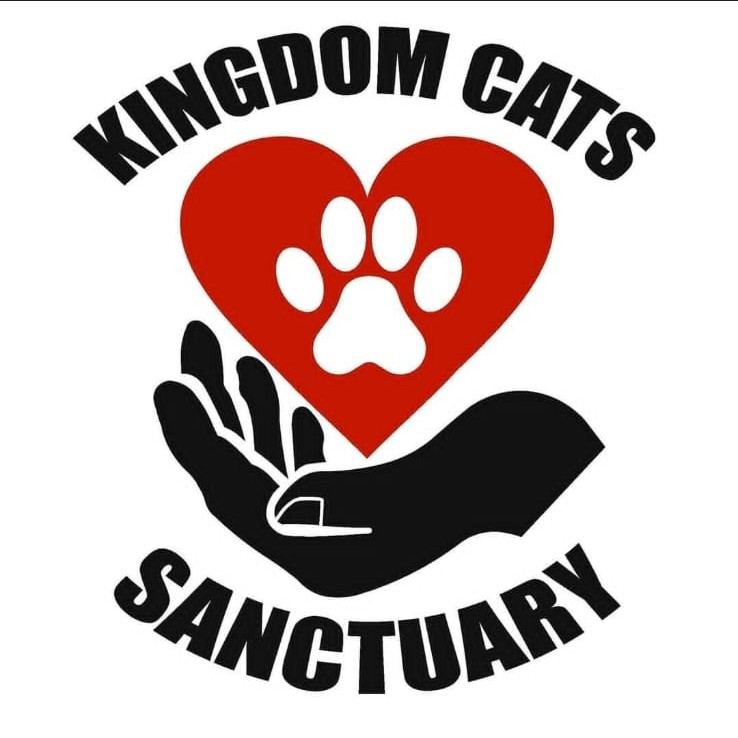

# INSY7315-App-Kingdom-Cats-Sanctuary
INSY7315 Information Systems 3E | WIL Project | ASP.NET Core (MVC + Web API) & Android Studio (Kotlin, Jetpack Compose)

---
## Group Members

| Name | Student Number |
|------|----------------|
| Tiara Naidoo | ST10453072 |
| Anelisa Mkhize | ST10288433 |
| Ayushi Jagganath | ST10452981 |
| Kivishnee Mel Subramoney | ST10438899 |
| Gia Jenica Gounden | ST10247357 |

**GitHub Repository:** `https://github.com/Mel-27/INSY7315-App-Kingdom-Cats-Sanctuary.git`

---
## App Purpose
Kingdom Cats Sanctuary is a no-kill cat sanctuary run by two founders, caring for over 200 cats across multiple sites. This project delivers a companion platform: an ASP.NET Core MVC website and a native Android app that gives the sanctuary a single digital system for managing adoption bookings, donations, events, merchandise, and community engagement, replacing what was previously an entirely manual, founder-run process.

Users can:

- Browse available cats and book a viewing session
- Donate via PayPal or Ozow, with receipts stored automatically
- RSVP to sanctuary events, filtered by date range
- Browse and purchase sanctuary merchandise
- Follow and contribute to a community blog
- Manage their profile, including theme, language, and currency preferences

Sanctuary administrators additionally get an Admin Dashboard to review booking requests, event RSVPs, and donations, and to manage cat, event, and merchandise listings.

---

## Design Considerations
The app was designed around requirements gathered directly from the sanctuary's founders, reflecting the organisation's limited staff and administrative capacity:
| Finding | App Response |
|---------|--------------------|
| Adoption viewings were arranged informally, with no booking record | Structured booking system with accept/reject workflow in the Admin Dashboard |
| No online donation platform existed | In-app donations via PayPal and Ozow, with automatic receipt storage |
| Marketing relied entirely on Facebook and TikTok | Dedicated Events and Community Blog screens to centralise outreach |
| Two founders manage everything with limited time | Single Admin Dashboard consolidating bookings, RSVPs, donations, and content management |

---

## Features
| Feature | Description |
|---------|-------------|
| Login & Registration | Firebase Authentication–backed sign-in and registration for both app and website users |
| Home | Sanctuary overview, no-kill promise, featured cats, founders, reviews, and quick actions |
| Cat Profiles | Browse adoptable cats with filters and view individual cat details |
| Book a Viewing | Book a viewing session for a specific cat, choosing a session type, date, and time |
| Donations | Choose a preset or custom amount, pay via PayPal or Ozow, receive a confirmation with receipt |
| Events | Browse sanctuary events, RSVP directly |
| Merchandise | Browse sanctuary merchandise with a tap-to-flip product card showing front and back |
| Community Blog | Community posts and comments, backed by Firebase Realtime Database |
| Reminders | View upcoming booked viewing sessions |
| Profile | 	Manage theme (light/dark), language, currency, and log out |
| Admin Dashboard | Sanctuary-management view: stats overview, booking request approvals, event RSVP management, recent donations, and quick access to manage cats, events, merchandise, and community content |

---
## Special Feature 1: Light & Dark Mode
**What it does:**
A theme toggle in the Profile screen switches the entire app between light and dark colour schemes.

**How to find it:**
Profile → Preferences → Dark Mode toggle

**How it works:**
- Theme state is managed through Jetpack Compose and applied globally from the app's entry point
- Selecting a mode updates the colour scheme across all screens immediately

## Special Feature 2: Multi-Language Support
**What it does:**
Lets users choose their preferred display language from the Profile screen.

**How to find it:**
Profile → Preferences → Language

**How it works:**
- The user's selected language is sent to a translation API, which returns translated text for the app's interface

## Special Feature 3: Currency Exchange
**What it does:**
Lets users choose their preferred display currency (e.g. ZAR, USD, EUR) from the Profile screen, so donation amounts can be shown in a familiar currency.

**How to find it:**
Profile → Preferences → Currency

**How it works:**
- The selected currency is sent to the Web API along with the donation amount
- The Web API calls a currency exchange API to convert the amount from ZAR before returning it to the client

## App Icon & Final Assets
<div align="center">
  
</div>

| Asset | Description | Location |
|-------|-------------|----------|
| App Icon/Logo | Kingdom Cats Sanctuary logo | `res/drawable/ic_logo.png` |
| Splash Screen | Displayed on app launch | `res/drawable/cat_splash_logo.jpeg` |
| Decorative Cat Photos | Static cat images used across Home and Community Blog | `res/drawable/cat_ginger.jpeg`, `cat_home.jpeg`, `cat_midnight.jpeg`, `cat_oliver.jpeg`, `cat_proof.webp`, `room_cat.jpeg` |
| Founder Photos | Sanctuary founder images shown on Home | `res/drawable/founder_1.jpeg`, `founder_2.jpeg` |
| Event Images | Images for each sanctuary event on the Events screen | `res/drawable/event_nip_sip_paint.png`, `event_golden_hours_market.png`, `event_spring_purrathon.png`, `event_picnic_kitties.jpg`, `event_open_day.jpg`, `events_hero_cat.png` |
| Donation Item Images | Icons for physical donation item categories | `res/drawable/donate_food.png`, `donate_equipment.png`, `donate_toys.png`, `donate_cleaning.png` |
| Merchandise Images | Front/back product images for the tap-to-flip merch card | `res/drawable/merch_tee_front.png`, `merch_tee_back.png` |
| Social Icons | Icons for Contact Us section links | `res/drawable/ic_facebook.xml`, `ic_instagram.xml` |

**Note:** the cat photos used for actual adoptable-cat profiles (not the decorative images above) are fetched dynamically from Azure Blob Storage since they're managed by sanctuary admins and change as cats are added or adopted.
---

## Technology Stack
| Technology | Purpose |
|------------|---------|
| Kotlin | Android app programming language |
| Jetpack Compose | Android UI toolkit |
| Android Studio | Android IDE |
| ASP.NET Core MVC + Web API | Website frontend and backend API, co-hosted in a single Azure App Service |
| Entity Framework Core | ORM for Azure SQL Database access |
| Azure SQL Database | Relational data store - bookings, donations, cat profiles, events, reviews |
| Azure Blob Storage | File storage - cat photos, blog images, merchandise images, donation receipts |
| Firebase Authentication | Shared identity provider for both web and Android clients |
| Firebase Realtime Database | Community blog posts and comments |
| Firebase Admin SDK | Server-side Firebase token verification and Realtime Database access |
| PayPal / Ozow | Donation payment processing |
| Currency Exchange API | Converts donation amounts between currencies |
| Coil | Async image loading in Jetpack Compose |
| Navigation Compose | In-app navigation |
| Material Design 3 | UI components |

---
## GitHub & GitHub Actions
**Branch Strategy:**

| Branch | Purpose |
|---|---|
| `main` | Production-ready code |
| `[Name]-Collaborator` | Individual per-collaborator feature branches (e.g. `Tiara-Collaborator`) |

Each team member commits their work to their own collaborator branch and pushes it so that teammates working on dependent parts of the system can pull it and continue building on top of it. Once a piece of work is complete, a Pull Request is opened; after review and approval by a teammate, it is merged into `main`.

---

## How to Run
**Prerequisites:**
- Android Studio (latest stable version)
- Android SDK
- Emulator or physical Android device

**Steps:**
1. Clone the repository:
```
git clone https://github.com/Mel-27/INSY7315-App-Kingdom-Cats-Sanctuary.git
```
2. Open the project in Android Studio
3. Let Gradle sync complete
4. Run on an emulator or physical device

The backend (Web API) is already hosted on Microsoft Azure, so no local backend setup is required, the app connects to the hosted API directly.

---
## Database Overview
Kingdom Cats Sanctuary uses two databases, both accessed only through the Web API — neither client (MVC frontend nor Android app) connects to either database directly.

**Azure SQL Database**:

| Entity | Description |
|---|---|
| Cat | Cat profiles available for adoption |
| Booking | Viewing session bookings |
| Donation | Donation records, including amount, payment method, and status |
| Event | Sanctuary events, including date, cause, and RSVP details |
| Review | Visitor/adopter reviews shown on the Home screen |

**Firebase Realtime Database**:

| Entity | Description |
|---|---|
| Blog Post | Community blog posts |
| Comment | Comments on community blog posts |

---
## References
GeeksforGeeks (2026). Adapter Design Pattern. [online] GeeksforGeeks. Available at: https://www.geeksforgeeks.org/system-design/adapter-pattern/ [Accessed 25 July 2026].

GeeksforGeeks (2026). Singleton Method Design Pattern. [online] GeeksforGeeks. Available at: https://www.geeksforgeeks.org/system-design/singleton-design-pattern/ [Accessed 25 July 2026].

GeeksforGeeks (2023). Software Architectural Patterns in System Design. [online] GeeksforGeeks. Available at: https://www.geeksforgeeks.org/system-design/design-patterns-architecture/#layered-architecture-ntier-architecture [Accessed 20 July 2026].

Harness.io (2024). Github Flow vs. Git Flow: What's the Difference? [online] Available at: https://www.harness.io/blog/github-flow-vs-git-flow-whats-the-difference [Accessed 2 July 2026].

nishanil (2023). Designing the infrastructure persistence layer. [online] Microsoft Learn. Available at: https://learn.microsoft.com/en-us/dotnet/architecture/microservices/microservice-ddd-cqrs-patterns/infrastructure-persistence-layer-design [Accessed 24 July 2026].

The Repository Design Pattern (2026). [online] UMLBoard. Available at: https://www.umlboard.com/design-patterns/repository.html [Accessed 26 July 2026].

---
